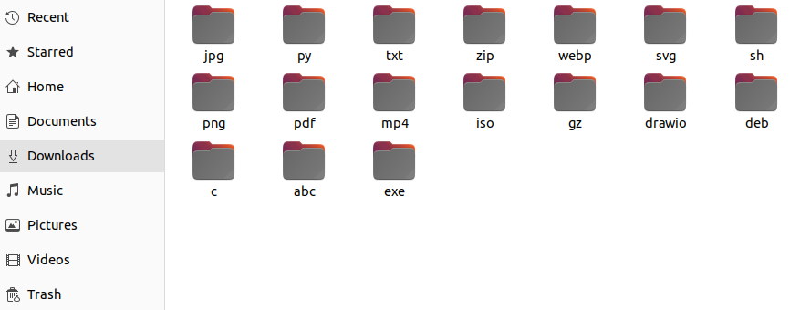

# McPhee 🧙

this code will:

- iterate through a directory
- takes each file
- extract its extension
- make a folder with the same name of that extension
- store the file inside that folder

basically:

finds a file called 'image.jpg' --> created a folder called jpg --> stores 'image.jpg' inside jgp folder

## run 🐍:

`python3 mcphee.py /path/to/directory`

| :exclamation:  this works only for linux, haven't tested it on windows/macOs  |
|-----------------------------------------|

you're more then welcome to contribute
